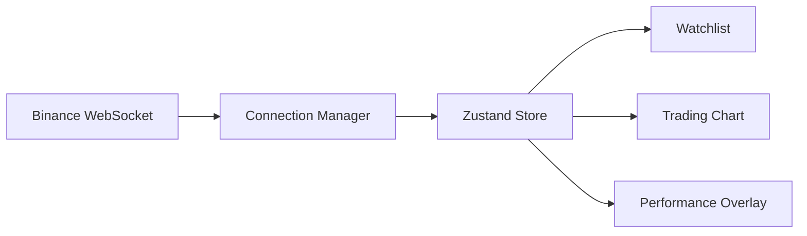
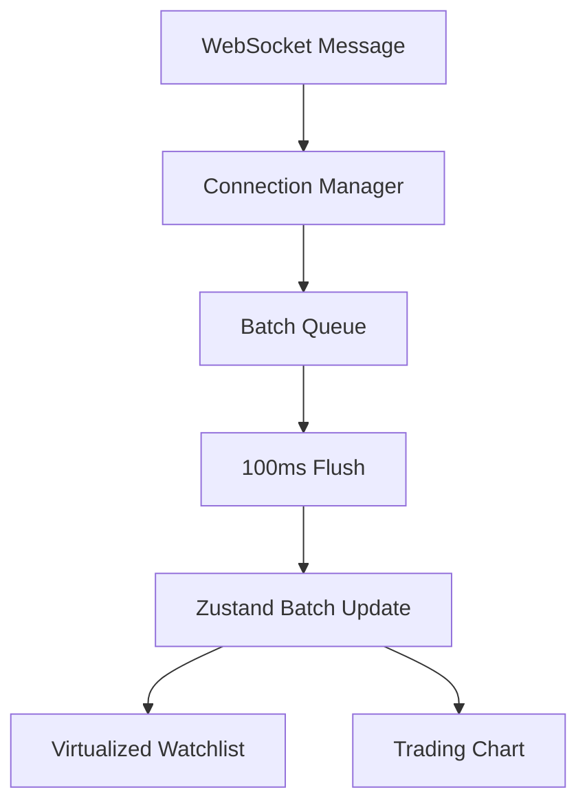

1. Architecture Diagram

2. Performance Diagram

3. Project Structure

src
│
├── app
│
├── pages
│
├── widgets
│
├── shared
│   ├── websocket
│   ├── store
│   ├── hooks
│   ├── components
│   └── utils
│
├── features
│
└── entities