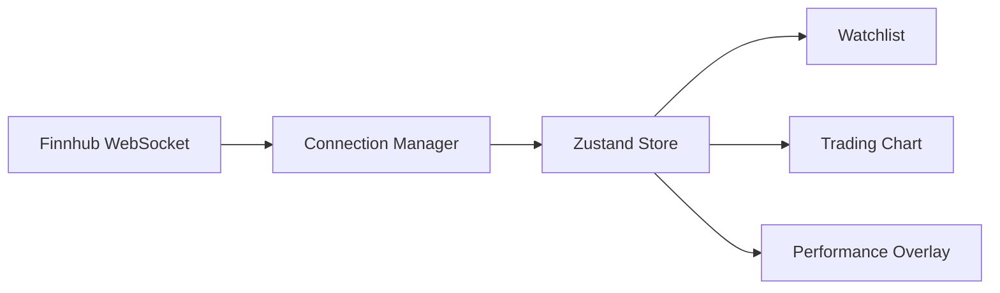
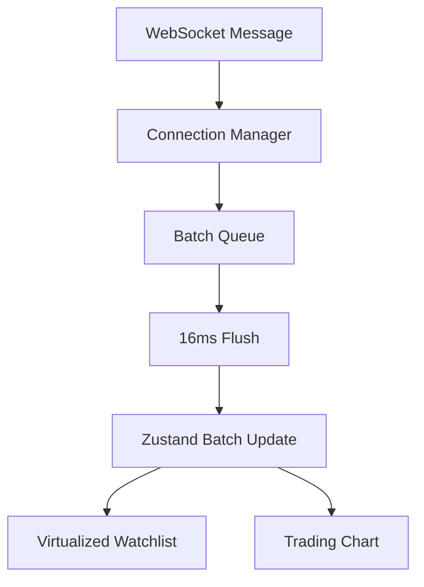

1. Architecture Diagram


```mermaid
flowchart LR

WS[Finnhub WebSocket]

CM[Connection Manager]

STORE[Zustand Store]

WATCH[Watchlist]

CHART[Trading Chart]

OVERLAY[Performance Overlay]

WS --> CM

CM --> STORE

STORE --> WATCH

STORE --> CHART

STORE --> OVERLAY
```

2. Performance Diagram


```mermaid
flowchart TD

A[WebSocket Message]

B[Connection Manager]

C[Batch Queue]

D[16ms Flush]

E[Zustand Batch Update]

F[Virtualized Watchlist]

G[Trading Chart]

A --> B

B --> C

C --> D

D --> E

E --> F

E --> G
```

3. Project Structure

```
src/
├── app/                    # App entry, providers, router
├── pages/                  # Route-level pages
├── components/ui/          # Shared UI primitives (shadcn/ui)
├── features/
│   ├── chart/              # Trading chart (Lightweight Charts)
│   │   ├── components/     # TradingChart, ChartSkeleton
│   │   ├── hooks/          # useChart
│   │   ├── types.ts
│   │   └── utils.ts
│   ├── dashboard/          # Dashboard layout and panels
│   │   ├── components/
│   │   │   ├── panels/     # ChartPanel, MetricsPanel, NewsPanel, PerformancePanel
│   │   │   ├── Dashboard.tsx
│   │   │   ├── Header.tsx
│   │   │   ├── Sidebar.tsx
│   │   │   └── StatusBar.tsx
│   │   └── ...
│   └── watchlist/          # Symbol watchlist with search/filter/sort
│       ├── components/     # Watchlist, WatchlistRow, SearchBar
│       ├── hooks/          # useFilteredSymbols, usePriceFlash, useSortedSymbols
│       ├── utils/          # filtering.ts, sorting.ts
│       ├── store.ts        # Watchlist UI state (Zustand)
│       └── types.ts
├── shared/
│   ├── websocket/          # ConnectionManager, batching, events, types
│   ├── store/              # marketStore (Zustand), selectors, types
│   ├── components/         # ErrorFallback, NewsSkeleton, ChartErrorBoundary
│   └── ...
├── layouts/                # DashboardLayout
├── lib/                    # Utilities (cn, BASE_URL)
└── test/                   # Test setup and tests
```